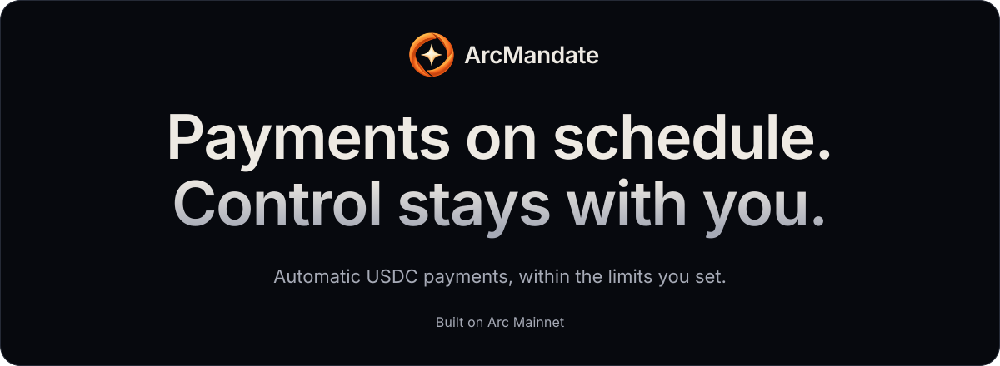
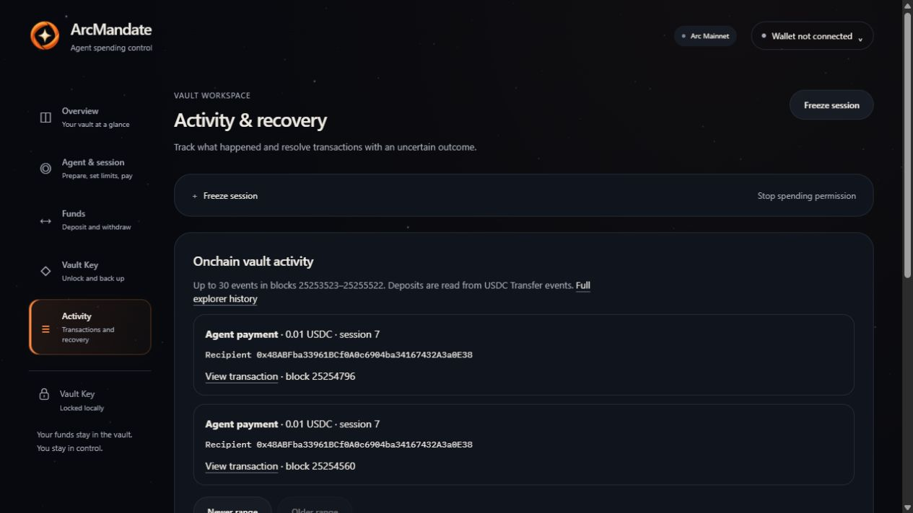
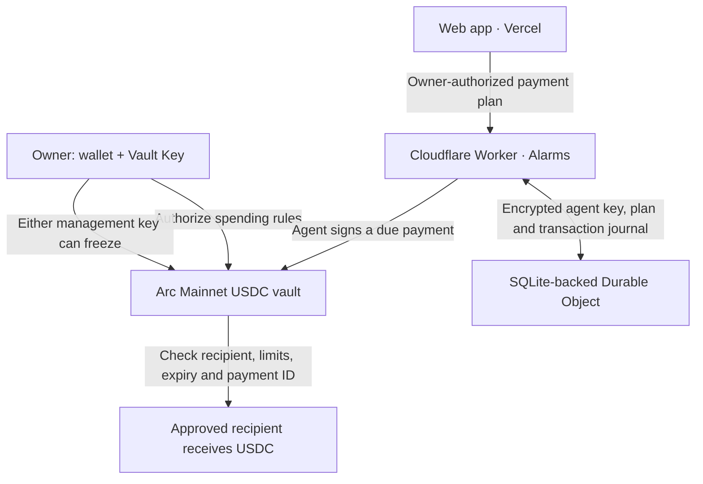

# ArcMandate

**Scheduled USDC payments on Arc Mainnet, with spending limits enforced by the vault contract.**

Choose who gets paid, how much and when. Authorize the agent through the website, then let it execute your schedule—even with the browser closed. Opening or changing spending authority and withdrawing funds require your wallet **and** a separate post-quantum Vault Key.

**[Open the app](https://arcmandate.vercel.app)** · [Explore the mainnet vault](https://arcmandate.vercel.app/?network=mainnet&vault=0x99cAae907095bBB95D8714ee2a23369dB2377d7A) · [View the contract](https://explorer.arc.io/address/0x99cAae907095bBB95D8714ee2a23369dB2377d7A) · [Developer guide](DEVELOPMENT.md)

## Why it exists

Repeating a payment manually means returning to a wallet and approving each transfer. Delegating payments needs a way to limit what the executor can spend.

ArcMandate combines automatic execution with an explicit spending mandate. USDC stays in your vault until an allowed payment goes directly to its recipient. The agent receives permission to spend under your rules; it does not receive your management keys or the vault's entire balance.

This makes the prototype useful for scheduled contractor payments, recurring contributions and small service payments to known USDC addresses.

## What you can do today

| Feature | What it gives you |
| --- | --- |
| **Web-based automatic payments** | Prepare a payment account and activate a finite schedule without a terminal, private-key import or per-payment wallet prompt. |
| **Contract-enforced limits** | Restrict recipients, total spending, each payment's amount and the session's expiry. Every payment must satisfy the contract. |
| **Wallet + Vault Key approval** | Require two separate authorizations to grant spending authority or withdraw funds. Arc verifies the post-quantum signature natively. |
| **Two ways to freeze** | Revoke spending with the owner wallet alone, or with the Vault Key through a funded relay. |
| **Visible payment history** | Inspect the plan's status and follow onchain payment receipts from the website. |

The current agent follows your schedule deterministically: one recipient, fixed amount, interval and 1–100 payments per plan. It does not use an LLM or choose purchases independently.

## A real mainnet demonstration

On **10 October 2026**, the hosted agent completed **two scheduled payments of 0.01 USDC** with the browser closed. The scheduler service was redeployed between the payments, and the second payment still executed.



*Actual mainnet activity, viewed without connecting a wallet. Both payments belong to session 7 of the reference vault.*

| Payment | Amount | Confirmed block | Onchain receipt |
| --- | --- | --- | --- |
| First scheduled payment | 0.01 USDC | 25254560 | [View transaction](https://explorer.arc.io/tx/0xa8ee649567be40eefc93cd894a1b8fa6d8b97c709073fcfcc6ff8a3c18e0f5a3) |
| Second scheduled payment | 0.01 USDC | 25254796 | [View transaction](https://explorer.arc.io/tx/0x5cc09bb95d3f41789abd24059680f1c31ae7087b9c879708b4d0ddea64710897) |

The receipts verify the onchain payments. Browser closure and service redeployment were observed during the acceptance run; those conditions are not established by the receipts alone. The demonstration session has since expired, so the public vault view is a historical example, not an ongoing payment plan.

## How you use it

1. **Create your vault.** Connect an owner wallet on Arc Mainnet. Generate the Vault Key, download its encrypted backup and restore that file to verify it before creating the empty vault.
2. **Prepare and fund.** In **Agent & session → Automatic payments**, sign a free login message and prepare the payment account. Deposit payment funds into the vault and separately add USDC to the agent account for network fees.
3. **Set the mandate.** Choose 1–5 allowed recipients, a total budget, a per-payment cap and an expiry. Open the session with your wallet and Vault Key after funding is ready.
4. **Activate the schedule.** Choose a recipient, amount, first payment time, interval and count. Review and activate the plan. The hosted agent signs and submits due payments without further wallet approvals.
5. **Track or stop.** Check service status and onchain activity. Pause stops new service submissions; freeze revokes the contract's spending authority. After freeze confirmation, use both management keys to withdraw the remaining vault funds.

For example: fund a vault with **0.03 USDC**, allow one recipient, set a **0.03 USDC** session budget and a **0.01 USDC** per-payment cap, then schedule **two 0.01 USDC payments two minutes apart** before expiry. The payments consume 0.02 USDC of the vault balance; network fees come from the agent's separate account.

Opening a session grants permission. Activating a plan starts the hosted automation. Closing the website or locking the local Vault Key does not stop an authorized plan.

## The spending boundary

The vault checks these conditions on **every** agent payment:

| Contract rule | Result |
| --- | --- |
| Correct agent and current session | Another sender or an old session cannot pay. |
| Approved recipient | Payments to other addresses revert. |
| Per-payment cap | An oversized payment reverts. |
| Remaining total budget | Cumulative spending cannot exceed the session budget. |
| Active, unexpired session | Frozen or expired authority cannot make payments. |
| Unused payment ID and sufficient balance | Repeated payment IDs within a session and payments exceeding the vault balance revert. |

Depositing more USDC increases the vault balance; it does not renew the budget or expiry. Replacing a session invalidates the old authority. An expired or exhausted session must still be frozen before withdrawal.

## Why Arc is part of the design

- **USDC for funds and fees.** Vault balances, recipient payments and transaction fees use USDC on Arc Mainnet, chain ID **5042**.
- **Native post-quantum verification.** The vault calls Arc's **SLH-DSA-SHA2-128s** verifier for Vault Key approvals when opening/replacing sessions, withdrawing or using the PQ freeze path.
- **Direct onchain enforcement.** The deployed contract checks the mandate and transfers USDC directly to approved recipients. The hosted service cannot change those rules by itself.

Post-quantum approval protects the application's management authorization. The outer EVM wallet transaction, frontend and network remain separate security boundaries; this is not a claim that the entire system is quantum-proof.

## How it runs with the browser closed



Vercel serves the web interface. Cloudflare stores the plan and executes it through Durable Object alarms, without a browser, desktop process or Vercel cron job. Timing is enforced by the service; spending authority is enforced by the contract.

The service saves signed transaction bytes, hash, nonce and payment ID **before broadcast**. Retries reconcile the original receipt or rebroadcast the same bytes. Conflicting nonces pause execution for review. This works alongside the contract's payment-ID replay check; it is not a universal exactly-once guarantee across unrelated business requests.

## Current scope and security

**Experimental prototype; no independent security audit.**

- One immutable owner, one fixed Vault Key and at most one active agent session per vault. There is no upgrade, key rotation or lost-key recovery path. Preserve both owner access and the encrypted Vault Key backup/password.
- The service holds the agent signing key encrypted under a Worker secret. It receives neither the owner private key nor the Vault Key. A compromised service/operator can spend within the remaining authorized mandate and access the agent's separate gas funds.
- Vault payment funds and agent gas funds are separate. Each submitted agent payment has a 0.01 USDC network-fee cap; unused gas can be returned to the owner after freeze and pending-payment reconciliation, less a buffered fee.
- Cloud/RPC outages, quotas or insufficient gas can delay or pause payments. Times missed by at least 60 seconds are skipped, without a catch-up burst. A transaction already broadcast may confirm after pause or stop; freeze takes effect when mined.

See the [threat model](THREAT-MODEL.md) for the complete trust boundaries and remaining wallet/recovery integration issues.

## Build and verify

The application uses **React, TypeScript and viem**, **Solidity** vault contracts, browser-based **SLH-DSA** signing, and **Cloudflare Workers + SQLite Durable Objects** for hosted execution.

Prerequisites: **Node.js 22.12+**, **npm 11** and **Foundry** for contract compilation. Exact release versions are recorded in [toolchain.json](toolchain.json).

```sh
npm ci
npm run artifacts
npm run dev
```

Local development defaults to **Arc Testnet**. Production selects Mainnet at build time; a query parameter cannot change a testnet build into mainnet.

```sh
# TypeScript, contract tests and builds
npm run check

# Mainnet frontend, using the generated contract artifact
npm run build -w @arcmandate/web -- --mode mainnet

# Validate the hosted automation bundle without deploying
npm run automation:build
```

Automated checks cover policy limits, recipient restrictions, expiry, replay rejection, authorization mutations, session invalidation and scheduler recovery. Real network acceptance complements those checks; neither substitutes for an independent audit.

| Read next | Purpose |
| --- | --- |
| [Developer guide](DEVELOPMENT.md) | Detailed web walkthrough, local setup, service deployment and transaction recovery |
| [Threat model](THREAT-MODEL.md) | Key custody, authorization and execution assumptions |
| [Vault contract](contracts/src/ArcMandateVault.sol) | Spending and management rules |
| [Automation service](services/automation) | Scheduler, authentication, encrypted agent keys and durable execution |
| [Web application](apps/web/src) | Wallet workflow, Vault Key and payment-plan interface |
| [Deployment records](deployments) | Public contract and historical validation evidence |
